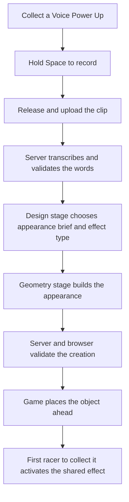

# How the game works

Start with [the README](../README.md) to play or run the game. This guide is a tour of the code for someone joining the project; detailed API and physics parameters are linked at the end.

## Three parts of one application

The browser runs the race and draws the scene. A small server handles requests that need an API key. A shared package defines the data they exchange so both sides can reject an invalid creation.

| Workspace | Role | Main tools |
| --- | --- | --- |
| `apps/web` | Menus, 3D rendering, player controls, race simulation, and microphone capture | React, Vite, React Three Fiber / Three.js |
| `apps/server` | HTTP API, speech transcription, generation stages, validation, and paid-attempt limits | Node.js, Fastify, OpenAI SDK |
| `packages/shared` | Validated data formats, inferred TypeScript types, fixtures, and event presets | Zod, TypeScript |

Bun installs dependencies and runs workspace scripts. The backend and test runner execute on Node. `bun run dev` starts Vite on port 5173 and Fastify on port 3001, with a watcher for the shared package. Vite forwards `/api` requests to Fastify. If you change the backend port, update the proxy in `apps/web/vite.config.ts` too.

Rivals are simulated in the browser. There is no multiplayer server, database, or player account system. Hosting access controls, when enabled, belong to Vercel rather than game code.

## Follow one voice creation

The race continues during recording and generation. A run can offer up to two voice stars, each granting one fresh attempt. Later stars depend on the remaining race time; there is no encore. An empty transcript, more than ten words, a timeout, or cancellation ends that attempt; there is no automatic retry.

In live mode, transcription uses a recorded clip. The design model chooses one supported effect type and writes a visual brief; the server supplies its balanced strength and duration. The geometry model receives only the visual brief. Models return structured data, and the browser renders only a completed, validated result.

Mock mode takes the same route through the application using prepared text and creations. It does not understand the recording. This lets contributors check the interaction without paying for speech or generation.

The generated object and the Voice Power Up are different things. The star grants permission to ask; the generated object waits to be collected. Its effect can reach every active racer, including its creator and the racer who triggers it. A creation already in the world remains available to other racers after its creator passes it or finishes.

## Where to change things

| Area | Entry points | Responsibility |
| --- | --- | --- |
| Main game page | `apps/web/src/pages/GamePage.tsx`, `game/MovementTest.tsx` | Personnel selection, setup, countdown, keyboard actions, and race UI |
| Simulation and movement | `game/RaceScene.tsx`, `practice-race.ts`, `freefall-controller.ts` | One fixed-step clock; movement, opponents, items, and finish state |
| World and characters | `game/race-course.ts`, `RaceObjects.tsx`, `GregModel.tsx`, `scripts/build-greg.py` | Course geometry, rendering, and reproducible dinosaur assets |
| Speaking attempt | `game/race-event-host.ts`, `creation-attempt.ts`, `voice/RaceVoiceControls.tsx` | Two-star scheduling, individual attempts, setup, cancellation, and queued spawning |
| Microphone and client | `voice/recorder.ts`, `race-event-voice-client.ts`, `race-events/client.ts` | Capture audio, request transcription/generation, and validate progress/results |
| Shared effects | `apps/web/src/race-events/runtime.ts`, `bridge.ts`, `RaceEventRenderer.tsx` | Resolve collection, calculate effects for racers, and draw feedback |
| Server pipeline | `apps/server/src/generation/pipeline.ts`, `apps/server/src/generation/stage-transport.ts`, `apps/server/src/voice/routes.ts`, `apps/server/src/voice/transcription.ts` | Shared paid admission, transcription, design, geometry, and request cleanup |
| Hosting | `vercel.json`, `apps/server/src/vercel.ts`, `apps/server/src/hosted.ts` | Route frontend/API traffic and explicitly enable production AI |

Web paths abbreviated as `game/...` or `voice/...` are under `apps/web/src`.

`MovementTest` is a historical name for the current main game. `CreationDemoPage`, `DemoGame`, `PlayerController`, and the v2 `RaceCreationHost` remain as older integration/regression code; they are not the page mounted by `GamePage`.

## Movement, appearance, and effects

`RaceScene` owns the sole 120 Hz simulation clock. During a race step, `RaceEventBridge` obtains forces, one-shot impulses, and obstacle protection from the event runtime. The normal racer controllers apply them while updating movement, then the bridge checks the movement segments for contacts. Rendering and microphone callbacks never integrate movement themselves.

The four shared effects are gravity vortex, debris storm, shockwave, and safe slipstream. They use bounded, game-authored parameters. Ordinary inventory items are a separate mechanic and keep their own timers and rules.

Generated appearance can be a recipe of boxes, spheres, cylinders, and cones, or an experimental list of vertices and triangles. The browser compiles a primitive recipe into one mesh. Neither format contains executable code or collision settings.

Game coordinates are measured in meters, with +Y up and falling toward -Y. Generated model coordinates are local to the object: +X right, +Y up, +Z toward its front; rotations use XYZ Euler radians. The renderer fits the model for gameplay, while the game sets an independent 10 m collection radius. A bigger model therefore does not secretly get a bigger hitbox. See [visual bounds](prompt-to-mesh-pipeline.md#visual-contracts-and-rendering) for exact limits.

## Which data contract should I use?

| Contract | Used for | Reference |
| --- | --- | --- |
| `RaceEventCreation` v3 | Current race and the lab's Race events panel; one shared effect with server-balanced parameters | [Shared race effects](race-events-handoff.md) |
| `CreationSpec` v2 | Lab's Asset generation comparison and retained creation demo; one effect in generated lab results | [Generation lab](prompt-to-mesh-pipeline.md), [legacy demo](creation-skeleton.md) |
| `PowerUpSpec` v1 | Original fixtures and compatible `/api/powerups` clients | [Legacy power-up API](legacy-powerups.md) |

The main race sends recorded prompts to `POST /api/voice/events`. The event lab also supports text through `POST /api/lab/events`. Both use `GET /api/lab/profiles` for available configurations. Those routes remain in production even though the lab UI is excluded from the production build.

Use the schema for the feature you are changing; do not cast a v3 event into the older creation loop. Validate on both server and browser boundaries. Coordinate shared changes because gameplay and generation depend on the same package.

## Secrets, timing, and cleanup

A key belongs in the ignored `apps/server/.env` locally or a Vercel Secret when hosted. Only server code uses it. The browser receives profiles, progress, validated results, and safe errors. Key presence alone does not enable paid calls.

The application allows up to 8 seconds of recording, a separate 10 seconds for upload/transcription, then 30 seconds for generation. Design uses at most 8 seconds of that generation window; geometry gets the time left. A live voice attempt can make up to three API calls under one consent and allowance entry.

Pause, restart, finish, and navigation cancel pending race requests and reject stale results. Audio is kept in memory for the request. Lab comparison history and the race's last-result replay are also in memory; neither stores audio.

Local live mode defaults to three attempts per server start. Hosted mode defaults to 100 per instance. These are temporary counters, not a durable or global spending cap. Read [voice setup](voice-input-plan.md#enable-live-ai-locally) or [deployment](deployment.md) before deliberately enabling paid calls.

## Read next

- [Contributing](../CONTRIBUTING.md): a focused change, checks, and review.
- [Voice guide](voice-input-plan.md): microphone setup and common failures.
- [Generation lab](prompt-to-mesh-pipeline.md): model profiles, comparisons, and wire formats.
- [Shared race effects](race-events-handoff.md): exact runtime interfaces and effect parameters.
- [Art guide](dinosaur-art-direction.md): characters, animation, and rebuilding assets.
